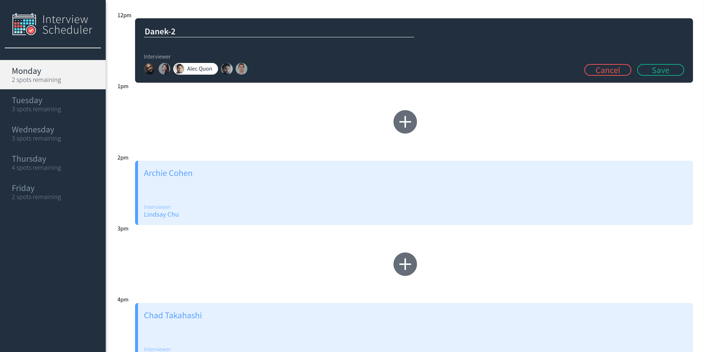

<a name="readme-top"></a>

[![React][React.js]][React-url]
# Interview Scheduler

<a></img></a>

<!-- TABLE OF CONTENTS -->
<details>
  <summary>Table of Contents</summary>
  <ol>
    <li>
      <a href="#about-the-project">About The Project</a>
      <ul>
        <li><a href="#Notable-npm-dependencies">Notable NPM Dependencies</a></li>
      </ul>
    </li>
    <li>
      <a href="#getting-started">Getting Started</a>
      <ul>
        <li><a href="#get-scheduler-api">Get Scheduler API</a></li>
        <li><a href="#using-interview-scheduler">Using Interview Scheduler</a></li>
      </ul>
    </li>
    <li><a href="#roadmap">Roadmap</a></li>
    <li><a href="#Screenshots">Screenshots</a></li>
 
  </ol>
</details>
<br>

## About the project

This project was built with the goal of creating a working single page interview shcheduler using the React framework. The project makes api calls to a custom scheduler-api using axios to fill out current interviews. 

The project is intended as an introduction to React, using states, custom hooks and various testing frameworks.

The scheduler is able to add, edit or delete current interviews and expects a user to provide a name and select an interviewer.

The scheduler will also handle errors if the api is unable to save a users interview.

Storybook is used for unit testing and to build components to be added to the interview shceduler using mock data.

Jest is used for integration testing of the scheduler, while cypress is used for a true browser test of the interview scheduler.

<br>

## Notable NPM Dependencies
<ul>
<li>Axios data fetching from database
<li>React: v16.9.0
<li>react-Dom: v16.9.0
<li>Cypress: Testing
<li>Jest: Testing
<li>Storybook: Component building
<li>Webpack Development Server: local hosting of site for development
</ul>

<p align="right">(<a href="#readme-top">back to top</a>)</p>

<br>

# Getting Started

## Get Scheduler API
Clone [Scheduler Api][API-URL] and follow the setup instructions for PostgreSQL server. 

If you do not have a PostgreSQL server, you will need to install it prior to following those instructions.

<br>

## Setup Interview Scheduler

### Install dependencies 
```sh
npm install --save-dev-dependencies
```

## Using Interview Scheduler

### Running Webpack Development Server

```sh
npm start
```

## Running Jest Test Framework

```sh
npm test
```

## Running Storybook Visual Testbed

```sh
npm run storybook
```

## Running Cypress

```sh
npm run cypress
```
<p align="right">(<a href="#readme-top">back to top</a>)</p>
<br>

# Roadmap

- [ ] Add user log in
- [ ] Only allow users to add, edit or delete their own interviews.
- [ ] Implement user profiles, including avatars, contact info and a list of upcoming interviews.
- [ ] Deploy server to Heroku
- [ ] Deploy Continuous integration using CircleCI and Netlify

<p align="right">(<a href="#readme-top">back to top</a>)</p>

# Screenshots
### Main page on first load.
#### This may differ as the scheduler api randomizes appointments
<a></a>
<p align="right">(<a href="#readme-top">back to top</a>)</p>
<br>

### Add Interview
#### Shows the screen a user is presented with when clicking on a (+) symbol to add interview
<a></a>
<p align="right">(<a href="#readme-top">back to top</a>)</p>
<br>

### Add Interview - Validation
#### App will validate that the user has input both a student name and selected an interviewer and present a clear error should either be missing.

<a></a>
<p align="right">(<a href="#readme-top">back to top</a>)</p>
<br>

#### Notice that the interviewer selected will be highlighted once selected.
<a></a>
<br>

### Add Interview - Completed
#### Once an interview is successfully booked, it will be added to the list. Note that the spots for Monday has been decremented by 1 upon successful booking. This is done by checking the state and is calculated dynamically rather than just adding or substracting 1. This also applies upon deletiong.

<a></a>
<p align="right">(<a href="#readme-top">back to top</a>)</p>
<br>

### Hover Appointment
#### By hovering over an appointment, a user will find an edit, and delete icon. The interview also slightly changes colour in response.
<a></a>
<p align="right">(<a href="#readme-top">back to top</a>)</p>
<br>

### Edit Appointment
#### By clicking on the edit icon, a user is able to change the student name, as well as the selected interviewer.
<a></a>
<p align="right">(<a href="#readme-top">back to top</a>)</p>
<br>

### Delete Appointment
#### By clicking on the delete icon, a user is presented with a confirmation to delete prior to putting in the request to the API. Once deleted, the spots remaining will update appropriately.
<a></a>
<p align="right">(<a href="#readme-top">back to top</a>)</p>
<br>


[React.js]: https://img.shields.io/badge/React-20232A?style=for-the-badge&logo=react&logoColor=61DAFB
[React-url]: https://reactjs.org/
[API-URL]:https://github.com/lighthouse-labs/scheduler-api